# Planets

>The Earth is a very small stage in a vast cosmic arena. 
>>          Carl Sagan

## Introduction
This is why I prepared new application that send us to space. Yes, since now we are able to move to space, to see other planets with out going out from home. Project is in alpha stage and I need to change many things, but it works and I am proud of this.

I could not imagine how big progress I will achieve
I could not image that it is possible to make 3D project, similar to 3D shorter, that works in web browser.

- 3D in web browser thank to thee.js library
- Many charts thanks to chart.js
- Move control (cell phones only) thanks to gyroscopes build into cellphones

I did not know that it is possible;

> I have not seen similar project, but after hundreds hours of researching, experiments. 
I achieved more that I expected. 
>> It was only student project for coding boot-camp, but even though, 
>>> I will work on this project after submit, since I  put all heart into this and regardless of result that I get for this project I am proud of this and 
>>>> I will  love every user of this application.
>>>>> Peter Major

## What it is?

It is my 2nd project for **Code Institute** boot-camp. It is front-end web page that uses external api and can render charts.
I have chosen cosmos as my subject. I will work on this project after submitting, so it is **not DSF** (Do-Submit-Forget).   
Indeed here you can find **2 applications**, but for submitting I joined them into 1 project:

### 1st  Application - Search Assistant

It is search assistant- It uses **NASA** api in order to find **photos**, **videos** and **podcasts** about space.
>I would describe this as combination of Google, YouTube and Instagram for people who are interested in astronomy.

#### You can
- [x] connect to NASA api 
- [x] search
- [x] show informations

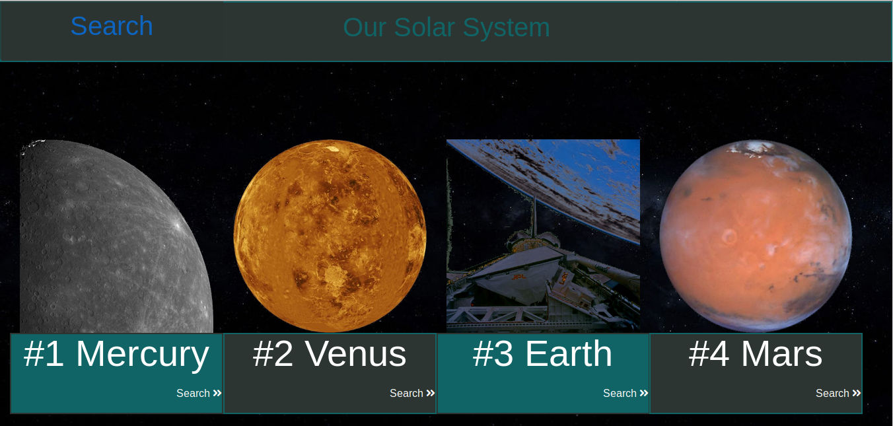
Image of 1st section 2D project. Here you can see recommended categories- our planets solar system.

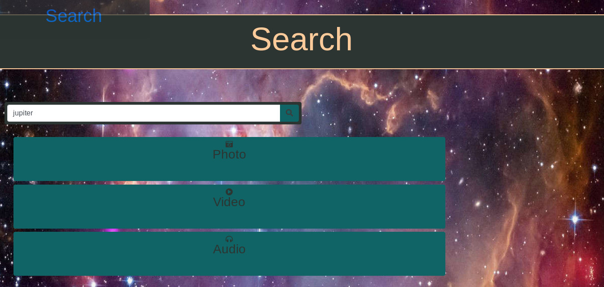
Here you can search. It has similar abilities as google- it can search data.

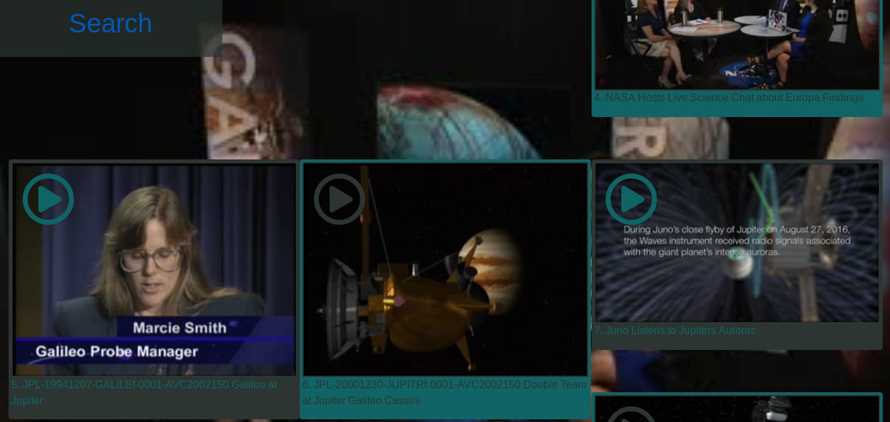

Results example. Videos about Jupiter.

#### Why it is so special?
- [x] lazy loading
- [x] infinite scroll
- [x] does not need refresh

It uses lazy loading and infinite scroll. 
It means all images are loading only when are near screen. 
Moreover you do not need to use pagination , when you scroll to end of page it loads next page automatically. 


## 2nd Application - 3D Space**
- [x] 3D web application 
- [x] Chart rendering 
- [x] can use camera 
- [x] work with phone sensors

>Imagination is more important than knowledge. For knowledge is limited to all we now know and understand, while imagination embraces the entire world, and all there ever will be to know and understand.”
>>Albert Einstein

In my journey into programming I am looking for challenges, something more sophisticated, hard skills such as **Virtual Reality**, **AI**, **Big Data**, **Games**. Therefore I was thinking of making something, that transgress imagination.


It is **3D visualization** of our solar system, that works in web browser. You can control this by 
- **mouse** and 
- **keyboard** for computers, as well as
- **touch screen**
- **gyroscope** - moving sensor for cellphones/tablets/other android devices. 
and:
- **camera** - in order to put planets in your room.

> To  Synchronize **gyroscope** was tremendous challenge, since not many applications in JS use this, especially alongside with **Tree.js** and **OrbitControls.js**.

Even thought I am not sure if it works for all phones in the same way, because it uses **empirical calculated** values.

```JS
angle_v+= gyroscope.x/60;
angle_h+= gyroscope.y/60;
```
Example of values that i used in order to synchronise **gyroscope** with **camera**. 


Image of 3D project

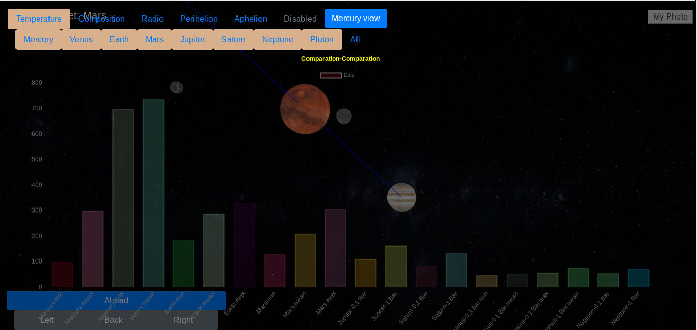
Chart example


Another example of chart


I daresay that **it** would be/**is** **challenge for** medium level, or even **seniors** to make something like this. 

### Why is so special?
It is unusual

## Installation

This version does **not required** installation.

## Important!
If you use **Google Chrome** or **Opera** In order to run application **offline**(from hard disc) you can face **CRC error**.
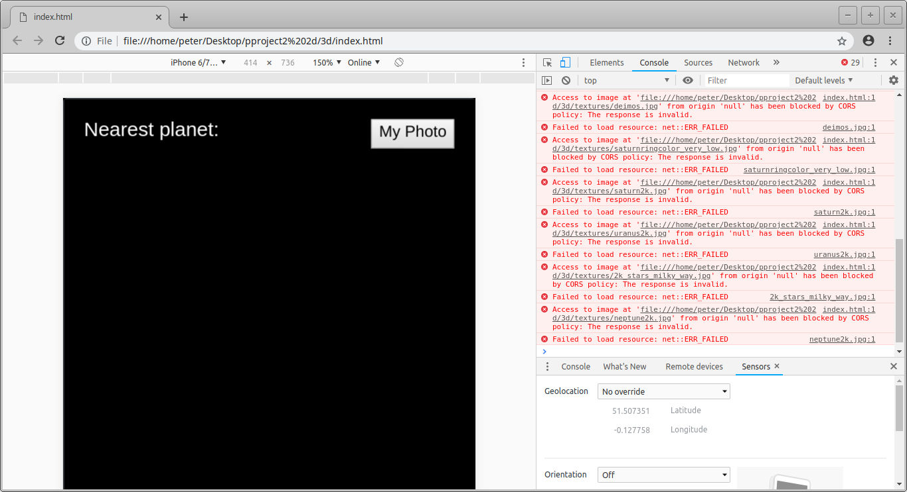
Example of CRC error

### Run online
Please use this link to open application (works on all web-browsers):
- https://majorpiotr.github.io/
and
- https://majorpiotr.github.io/3d/

You can also upload this on server for example **Apache**. It works fine on **localhost:80**). 


### Run offline
In order to start web page from hard disc open file **index.html** in **Firefox** web browser. **Does not works in Chrome and Opera when offline!**

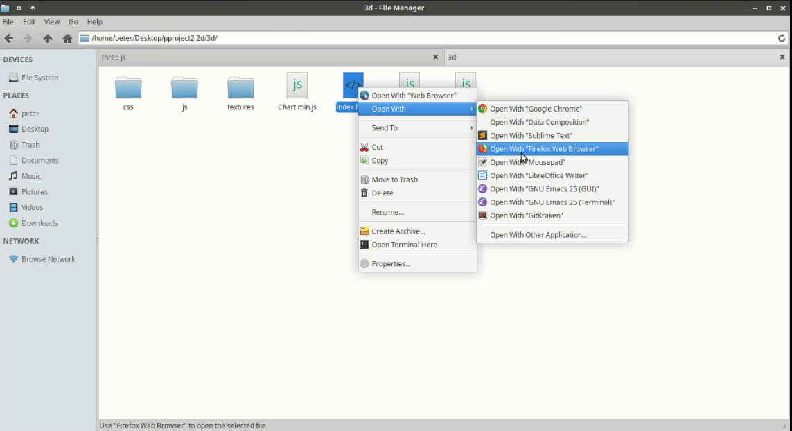
Open Index.html in **Firefox**

## Get start - how to use - Application 1

### Section 1

Here you can:
- [x] Choose keywords from recommended,
- [x] go to section 2

At the begin you will see only background - with no content, in order to see anything you have to scroll down page. 
Background is **fully animated**- it moves from left to right, and than back, so from right to left.

After scroll down you will see animation- content will rotate and become less transparent, to be fully visible after short time (**2.5s**)
The same approach I used in my previous project - **"The Doors"**. Both projects use the same combination of **css** classes and **jquery** functions made by me.  Almost every element of side is animated in the same way, so it applies to search results also.

Here you can see an example:

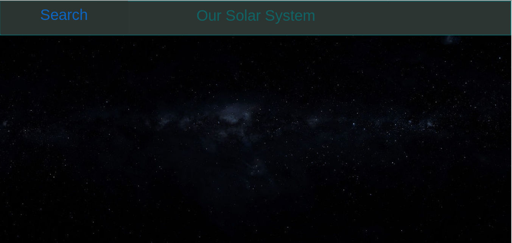
Application before scroll


Application after scroll

As you can see it contains **8 cards** with planets of our solar system. Those cards contain recommended by me keywords for searching. When you click on any of them you will move to bottom of page - searching section. 

- [x] it performs searching  
- [x] you will see search results 
- [x] it moves you to section 2

In **search-box** will appear name of planet that you clicked on, in results you will see search results for keyword  chosen by you (planet name).  So when you scroll down more you will see more content (in this case photos about chosen planet). This content is also animated.

> You can also used "search button" from left top corner, or just scroll down page.

How to use section 2 - the search section I explain you in this document. Now let's focus on search results.

### Search results

As you can expect "searching results" is kind of images gallery. It is similar to commonly used solution such as that used by **Google Images**, **Microsoft Bing**, **Pinterest**. Below you can see an example of searching results.

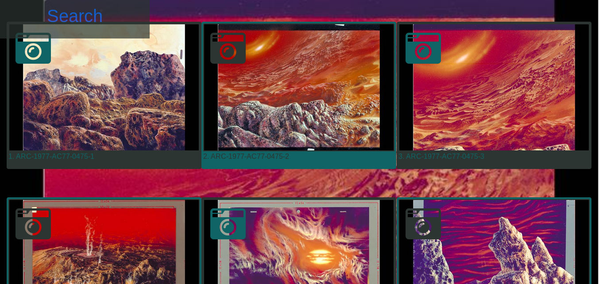
Example of searching results- Venus

I was considering **5 cards design** used **by Pinterest**, but I think **3 cards** has many benefits.
- of course you can see **less pictures** at one time, 
- but each picture is **bigger**, and it is **standard** solution **of Bootstrap**.
This is why I used 3 cards design.

On the **cellphones** everything **looks different**, since it uses 1 card design.

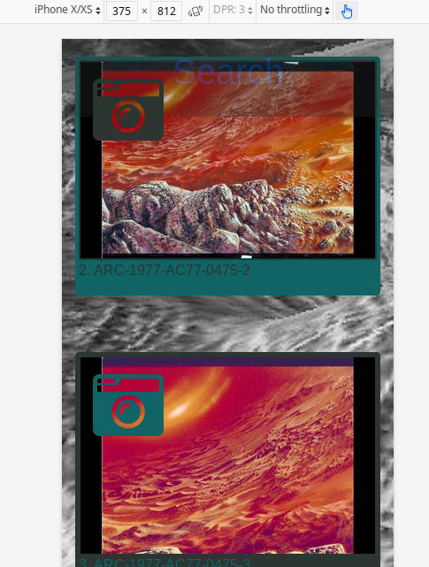

Example of searching results on cell phone- Venus

Page is fully responsive. 
When you rotate your device it look like this 

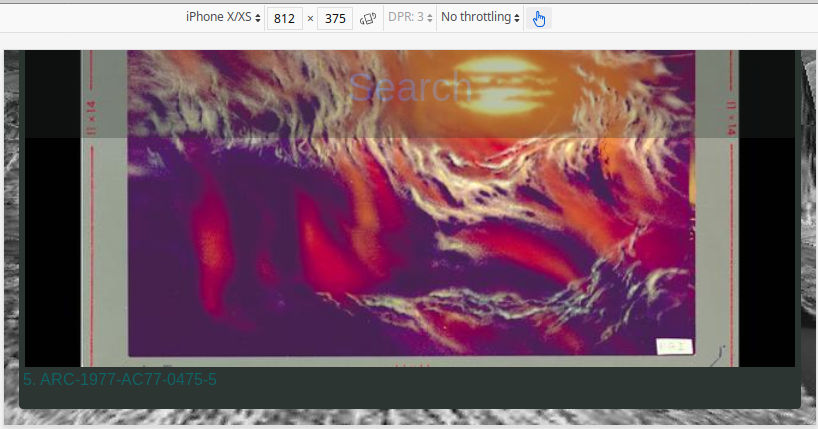
Example of search results on cell phone rotated- Venus

#### Cards

Each card includes:
- Content(in this case photo)
- Media type icon (in this case icon camera ). Media type icon is in left top corner of each card
- Title- is below content.

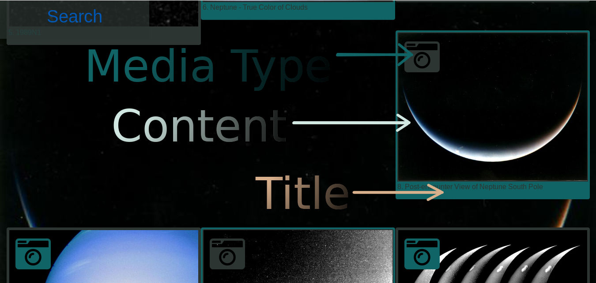
Example of Card. You can see content, media type and title.

As I said before application can search 3 types of media:
- [x] Images/Photos
- [x] Videos
- [x] Audios/Podcasts


Example of Video Card. You can see play icon in left top corner

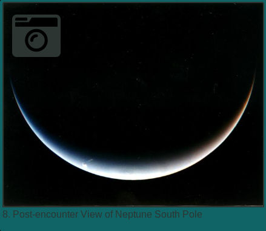

Example of Photo Card. You can see Camera icon in left top corner


Example of Audio Card. You can see Headphones icon in left top corner

#### Functions of cards

> **Hovering** on card will **change background** to image from content. **Image become bigger**- so you can see everything **more clearly**.
>> It happens thanks to **zoomable** css classes and   **function bigImg()**
>>> I used this also in my previous project - "**The Doors"**

Function **bigImg(obj_id)** is in **js/main.js** file, classes **zoomable** are in **css/style.css** file.


> Would you like to know more about how **background is changing** or how **images become bigger**? 
>> You can find more information in readme of my previous project - **"The Doors" **
>>> https://github.com/majorpiotr/the-doors/blob/master/README.md


**The most important** function of card **is to ... be open** (in modal)


### Content Modal and opening cards

Modal allows you to:
- [x] see/watch content,
- [x] search for keywords,
- [x] gain some more info about content;

Each card can activate **modal**- function **open_photo(elem)** from **js/main.js** file. 
**Modal** content dependence of card **is** of course for every card is **different**. 
Here you can example of opened modal:

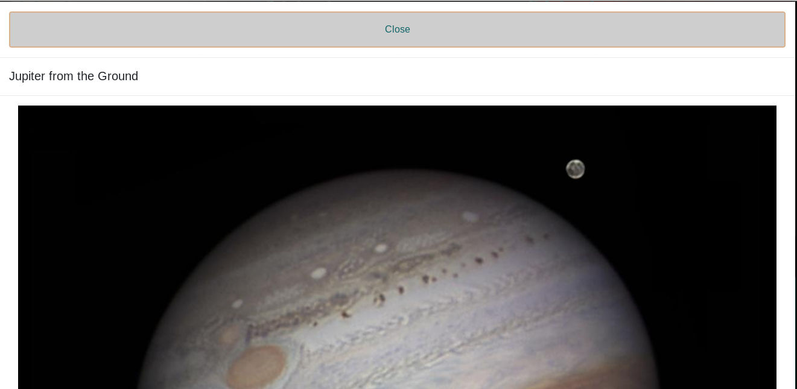
Example of Opened Modal

Each **modal includes** not only media **content**(image,video or audio), but also information's abound content, such as :
- **Description**- Description of image(for image) or text of speech for audio and video files  
- **Alternative files** - Only for images. Some images you can see in different resolutions. Clicking on any of file opens its in new tab of your web browser. Name of link is just src- it allow user to copy src in fast way.
- **Info** - More info about content, such as date, creator
- **Keywords** - Keywords corresponding to item. If you click on this it performs new searching, but **you have to close modal in order to see it.**

>Center **JPL** usually means that photos has been taken in space.

Here you can see example of bottom part of modal:
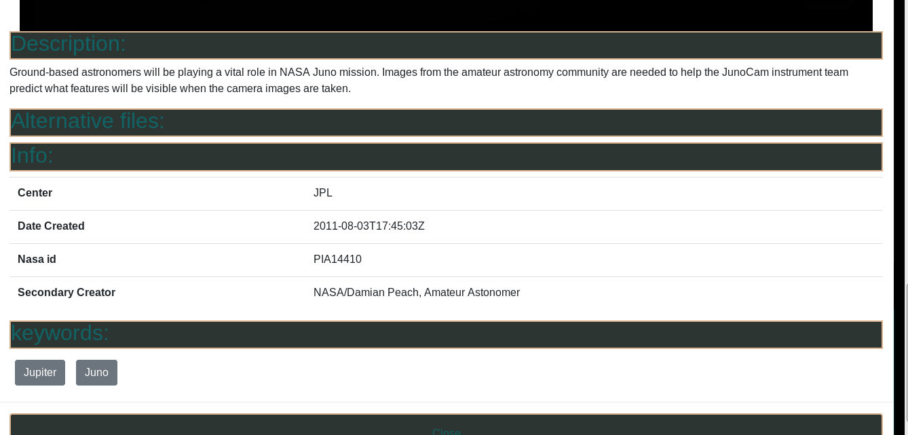
Example of Opened Modal - part 2

> **You can** not believe, but modal can **be** close (by **big** close button). 
>> Strange


When you have a look at code of function **open_photo(elem)** you see strange constructions such as:

```JS
if(x_description)
  {      
    regex = /__quote__/gi; 
    x_description=x_description.replace(regex, ' " ');
    regex = /__apostrophe__/gi 
    x_description=x_description.replace(regex, "'");
    $("#photo_modal_desc").text(x_description);
    $("#photo_modal_desc").removeClass("d-none");
    $("#photo_modal_desc").siblings().removeClass("d-none");  
  }
```
You can wonder why do I **check if it has description**? As you can see I check **each value**. 
It is because some of items **has no** descriptions/images(ex. audio files) or **info**. Checking if value exists allow me to remove some **blanks items**.
So... why did I used:

```JS
  regex = /__quote__/gi; 
    x_description=x_description.replace(regex, ' " ');
    regex = /__apostrophe__/gi 
    x_description=x_description.replace(regex, "'");
```

#### Issues

Issue with items with out some values was even **more dangerous**. Have a look at this code:
function **make_photo_row(i,api,page,link)** from **js/main.js**

```JS
if (api.collection.items[i].data[0].description) 
      {
        x_description= api.collection.items[i].data[0].description ;
        regex = /"/gi; 
        x_description=x_description.replace(regex, " __quote__ ");
        regex = /'/gi; 
        x_description=x_description.replace(regex, "__apostrophe__");
        html+='x_description="';
        html+=x_description;
        html+='"';
      }
```

As I mentioned before some element have no values- let's assume that items[10] has no description.

```js
x_description= api.collection.items[i].data[0].description ;
```

In this circumstances script will **crash**. 
I think all items have description, but I found many items with no photos, links, or info.

Let's come back to our question about
```js
regex = /__quote__/gi; .
```
Can you imagine this photo description:

> First start of rocket "Hercules". Pilot didn't press start button

Of course I made up this description, but pay attention to **"** and **'**. Those strings can easily **break down** script, and **attr("x_description")** of card will be:

>Firs start of rocket 

and than it render many trashes such as attributes Hercules, or Pilot. 

This is why I check if value exists, then change every **"** to **__quote__** and **'** to **__apostrophe__**. For rendering it works different way , so **__apostrophe__** becomes **'** and **__quote__** becomes **"**.


### Lazy loading and infinite scroll
Usually when you like to **load next** page of **photo/video/audio** gallery or search results you have to click **"Next"** or **page number**. Why?


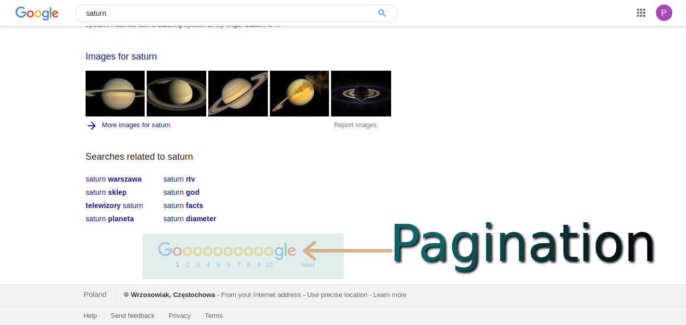
Example of Google Pagination
I dont think it is good idea to use this, since user has to clicks next in order to load next page.
Why don't we load next page automatically? **Google** uses this succesfully in their another product- **Google image**. 
In my application next page is loaded automatically when you scroll to bottom of page

#### How does it work? Lazy loading and infinite scroll
We start from infinite scroll

##### Infinite scroll
Please visit this page:

https://images-api.nasa.gov/search?keywords={venus%20}

It is api of **NASA**. It **returns** normal Json **file**. 

Click **collection**, **items**
Each page includes 100 items, since one **nasa-api.collection** has **100** items, first one is **0** and last one is **99**, and in this case it has 100 element. 
It means that one page of our gallery will has 100 elements.  Only the last page has less than 100.

Close items forder or click **collapse all** (in **Firefox**)
Now open 
**collection** **metadata**	**total_hits:	302**
Yes total_hits: **302** means that in there are 302 items  in database that meet our search criteria.

Close items folder or click **collapse all** (in **Firefox**)
Now open 
**collection** **metadata**	**total_hits:	302**
Yes **total_hits: 302** means that in there are **302** items  in database that meet our search criteria.

Open this in new tab.
Number of items is the same - **100**
Total hits **is** the same - **302**
but what about links **?**
Yes there are 2 items : **0** with **prompt:"Previous"** and **1** with **prompt:"Next"**

It means that for **load next** page we need
**collection.links[collection.links.length-1].href**
And indeed it is true.

Go to next page by using next link. And than repeat this again in order to visit page **4**, or use this link:
https://images-api.nasa.gov/search?keywords=%7Bvenus+%7D&page=4
Now check items. There are only 2 items, since:
- **302-100** from page 1 is 202.
- **202-100** from page 2 is 102.
- **102-100** from page 3 is 2

What about links? Check this now.
There is only 1 link  **0** with **prompt:"Previous"**. We don't like to load previous page because it is nonsense, so we need:

```JS
if(collection.links[collection.links.lenght-1].prompt=="Next")
{
  link=collection.links[collection.links.lenght-1].href;
}
```

Only when **prompt** is **Next** link will be taken from collection.links.

How to make this to load automatically?
Here we need function **isInView(elem)** that animate elements when they are on screen.  When last element will be on screen script will load next page.
Ok, how to determinate if element on screen is **last**? I used class **link_loader**. Only last element of page has this class. Function **isInView(elem)** check if element has this class, and than it loads:

```JS
 if ($("#"+id_card).hasClass("link_loader"))
    {
      tmp_api=open_link($("#"+id_card).attr("link"));
      // It fix "fast mouse scrolling + hover" bug
      $("#"+id_card).removeClass("link_loader")
      if (tmp_api)
      {
        api=tmp_api;
        page++;
        make_galery(api,page);
      }
    }  
```

Ok, it loads, but loads what? as you can see link_loader has special attribute **link**  and this is link with **prompt:"Next"** mentioned before. For loading script uses function open_link. What if we will scroll very fast over and over near **link_loader**?
It is issue, because it will load next page over and over. This is why after loading link script remove class link_loader from item. 

What about tmp_api? It prevent script from errors - when api answers in unexpected way and script will be not able to load link will not load this, instead of break down script.

I think that I explained how does it works in comprehensive way.

##### Lazy loading
Now lets focus on Lazy loading. Can you image loading of 100 images in one time? It takes time. So in order to make performance better I used some kind of loading step by step.
It uses function **isInView(elem)** in order to check if item is on screen. Here I show you html of picture:

```html

```
Pay attention to **x_src** and **src**. Are the same.  **But why?**
At the begin image has no attribute **src**, therefore there is **no image**, so image is **not download** from server.

When image is no screen, script copies **x_src** to **src**, therefore item has src, then image is download from server and you can see photo.
It applies only for search results images and this is why parent of those images has class **will_photo** . Let's check code of my function **isInView(elem)** again:

```js
if ($("#"+id_card).hasClass("will_photo"))
    {
      $("#"+id_card).children("img").attr("src",$("#"+id_card).children("img").attr("x_src"));
    }
 ```
 
 ##### Animations
 Search results items are animated in the same was as other items of page, so:
 
 ```js
 if ( id_card != false )
  {
    $("#"+id_card).css("animation-name", "apear_from_nowhere" );  
    $("#"+id_card).css("animation-duration", "2.5s");
    $("#"+id_card).css("animation-timing-function", "ease-in");
    $("#"+id_card).addClass("opacity-100"); 
    // it removes class "show_animation" in order to avoid errors, and machining next element.
    // without this function will machining the same element over and over .
    $("#"+id_card).removeClass("show_animation");   
    $("#"+id_card).addClass("show_done");  
```

### Search Section 
Now is time to explain searching section. Lets have a look at this:


Search Section

As You can expect when you write something in text box and click search it will search for this word. 
You can also change media type for :**photos, videos and audios**.
When you chose **photos** you will ably to filter results in order to see only **photos from space**.


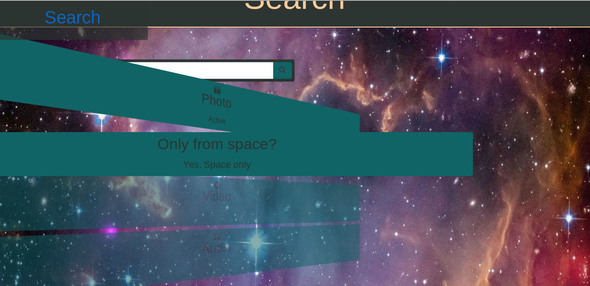
Photos - only from space

In previous chapter I mentioned pagination and that this page load's links automatically. However does it mean that we don't need pagination at all? No! I think that it is good idea to have one, therefore I prepared also pagination. Example you can see below:


Photos only_from_space

It is **visible** only when results **gallery** includes more than **100 items** (more than one page).


I tried to make it possible to search various type of data in one time. Unfortunately it does not work, unless script will sent 2 requests to api. In order to achieve this I need to make a lot of changes and it is not worth this effort.

### Do you mean?
Ok let's write something with spelling mistake. For example : "merkury".


Search with mistake

**Yes**, **NASA** databese has nothing about **"merkury"**. This is why **script** send request to other api **datamuse.com** in order to find words that corresponds with **NASA** and sound similar our word. 

> In order to search for words about nasa, and sound like merkury you use this query:
>> https://api.datamuse.com/words?ml=nasa&sl=merkury
>>> sl- sounds like ml- meaning

**"Mercury"** is result, so script render button with text **"Mercury"**. Now when we click on this, script will perform new searching - this time for word "Mercury".

Unfortunately it does not works as good as **google** , but I think it works good enough.

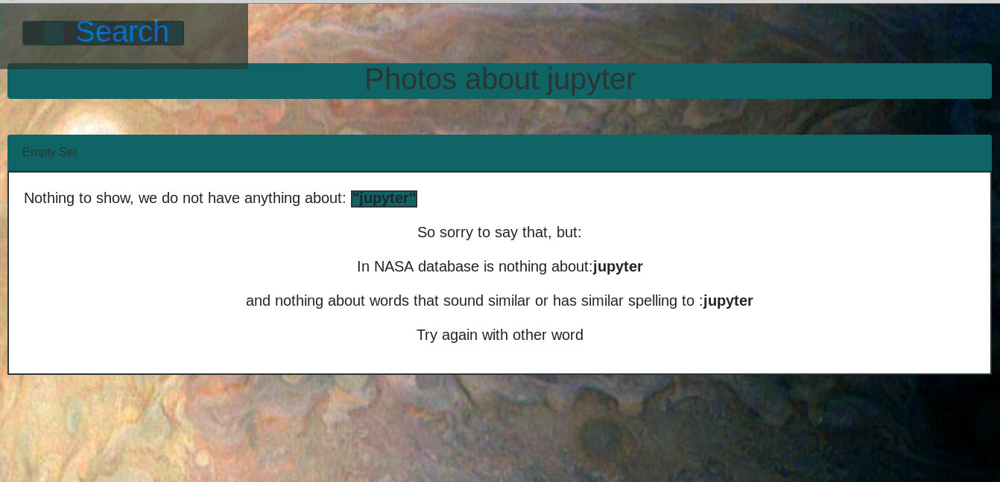
**Jupyter** instead of **Jupiter** does not work


## Aplication 2 - 3D webpage.

>“You cannot swim for **new horizons** until you have courage to lose sight of the shore.”
>> William Faulkner 

It project that, I am proud of. In order to discover effect of my effort go to https://majorpiotr.github.io/3d/
or click in this link on **application 1**:

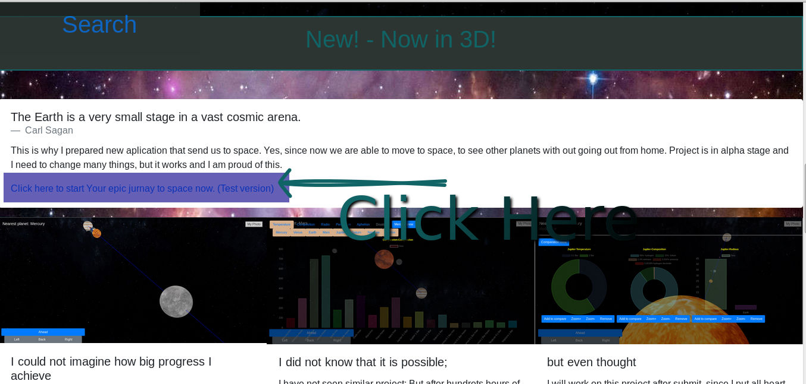
This link moves you to **Aplication 2**

### How to control?
In order to use **application 2** you can to use as well **mouse** as well as **keyboard**. If you played in any shorter game you it would be easy for you. so:

- **w** -move you ahead
- **s** -move you back
- **a** -move you left
- **d** -move you right

- **LEFT Mouse Button + Mouse move**- Move camera- **LEFT** button of mouse must be pressed!
- **Left,Right,Up,Down Arrows**- Move Camera
- **q** -move you up
- **e** -move you down

- **space** -move planets around Sun (it needs new algorythm, but it work)
- **1** - change camera to Mercury
- **2** - change camera to Venus
- **3** - change camera to Earth
- **4** - change camera to Mars
- **5** - change camera to Jupiter
- **6** - change camera to Saturn
- **7** - change camera to Uranus
- **8** - change camera to Neptune

- You can **hover on** or **touch**  screen buttons : **ahead**, **back**,**left**, **right**  in order to move.
- On cell phones with **gyroscope** it uses gyroscope in order to control camera.
- On cell phones with **no gyroscope** it uses **touch screen** - just move your finger in order to move camera.

### Chart rendering

Application uses **chart.js** for rendering charts. Maybe it is not as versatile solution as **D3.js** recommended by **CodeInstutute**, but  I think it looks  better and works fine. 
In order to see chart you have to click on planet, example below:


Chart Example- Mercury.

Right now it shows only basic data about planets:
- **Temperature** - in Kelvins
- **Compositions** -in %
- **Radius compared to Earth**

It uses **randomized colors**, since I had **no time** to set different colors for each planet.

Every chart you can **zoom in** and **zoom out**, by clicking buttons **zoom +** and **zoom -**

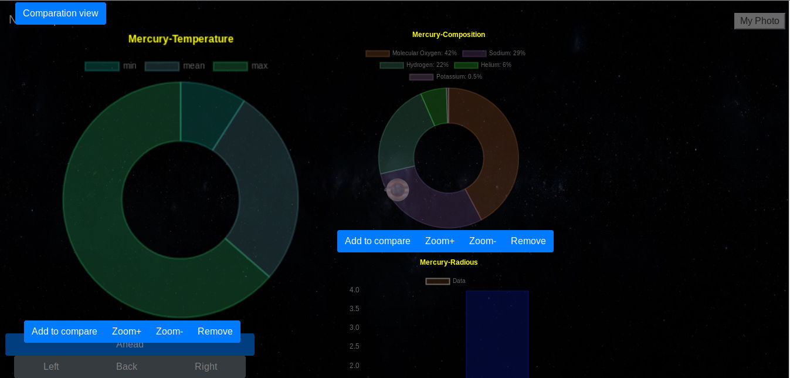
Chart zoomed Example- Mercury temperature is much bigger than other charts.


**You can** add up to 8 charts (there is some small issues with more then 5, no time to fix, since I would **love** to submit this **this year**).

- In order to do this click **Add to compare**, close modal (**right top or bottom corner**)
- Click **other planet** 
- Chart that you added to **compare** will be on the **same position** as before.
- Add **other chart** and **repea**t.
- Enjoy !

When you like to remove chart click **Remove**

You can any composition of charts! For example:

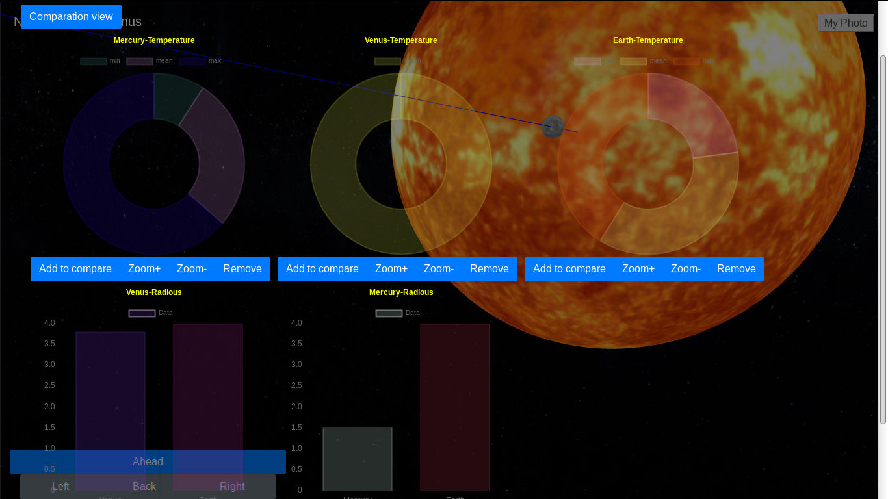
Chart Composition Example- comparison of temperature and radius of Mercury,Venus and Earth.

**Why** don't but everything on **one chart?**
**I tried** to put everything on one chart , **but it is pointless** to make chart on temperature and composition of planet, since those data uses different units.
However ***you can** have one chart of the same measures. In order to render one chart for many planets :

- **open modal** (click on planet)
- click **Comparation View**. 
- click **measure** that you like to see (eg. **Aphelion**)
- click planets that you like to have on chart (or **all** to add them all)
- by clicking selected planet **once more** you remove this planet from comparation.


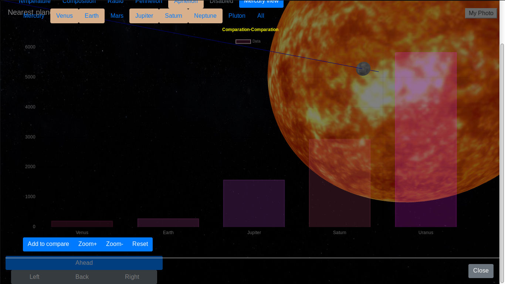
Chart Comparation Example- Aphelion of all planets in solar system, expect Mercury, Mars and Pluto

By clicking on blue button with **planet name view** you will back to view of charts for one planet.

I think this section needs some improvements such as:

- [ ] changing units kelvines/celciuses
- [ ] more data
- [ ] **new** colors.
- [ ] adding/changing background. However transparent option must be available
- [x] bug with modal **title**, and button text :)
- [x] unfortunately buttons **under** charts have some problems with smaller **screens** :)

> What have I done:

- [ ] - to solve out
- [x] - solved out

> All problems are easy to fix, but don't have time to do this now. Sorry. If it will have any impact on result please let me know-
>> i can fix this,
>>> but don't have time ;(

### My photo

On right top corner you can find **My photo** button. You can set video from your camera as background **of universe** :)
It works fine especially alongside with **cell phones** and **gyroscope**.
Can you imagine **Saturn in your kitchen?**


### Nearest planet

It shows you name of planet that is nearest to you.

### Moving planets

Press space for moving planets. It moves in good direction, but in new version I would like to apply special algorithm that calculate position of planets.

## Technologies that I used
For this project I used :

- **Bootstrap** – CSS framework https://getbootstrap.com/
- **Microsoft Visual Basic 6.0** - https://winworldpc.com/product/microsoft-visual-bas/60 
- **Jquery** – JS library https://jquery.com/
- **Fontawesome** – Library for Icons. https://fontawesome.com/
- **GIMP** - for making graphics (are in xcf files) and compresing textures  https://www.gimp.org/
- **NASA API**- for searching their database https://images-api.nasa.gov/
- **Api datamuse.com** For making do you mean function similar to google.one datamuse.com/
- **Chart.js** - for rendering charts. I think it is better than D3.js. https://www.chartjs.org/ 
- **Trhee.js** - for 3D rendering https://threejs.org/
- **OrbitControls.js** - Plugin for tree.js. https://threejs.org/docs/index.html#examples/controls/OrbitControls
- **Gyloscope** - For control aplication by moving phone. Tested on Android cellphone made by Huawai - works. Builded into web browser.
- **Textures**- Thank so much to solarsystemscope.com for free textures, that I used in 3D app. https://www.solarsystemscope.com/textures/
- **Sublime text**- As code editor. https://www.sublimetext.com/3
- **CSS from my project1** - I used the same css and some parts of html and js functions from my previous project "The DOORS"-https://github.com/majorpiotr/the-doors

>This **Microsoft Visual Basic 6.0** was not only joke, but also dream from childhood ;) 
>>Peter Major

## Colors 

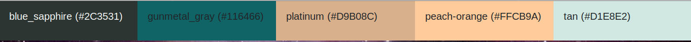

>Colors used on project

Web page uses colors that are modern and often used in SC movies , particularly :
* **blue_sapphire** (#2C3531)
* **gunmetal_gray** (#116466)
* **platinum**      (#D9B08C)
* **peach-orange**  (#FFCB9A) 
* **tan**           (#D1E8E2) 


The information's about colors I got from this web page: https://juiceboxinteractive.com/blog/color/ 

## What next?
- [ ] better design and ui 
- [ ] vue.js 
- [ ] back-end 
- [ ] Other planet moving algorithm 
- [ ] Logo and name 
- [ ] voice abilities 

>I am 100% sure that I will work on this project after submit this.  Unfortunately I had no time to improve some small issues (mostly **User Interface**, **Design**).

I am sure that this project deserves for:

### Better front-end solution (Vue.js)
**Jquery** is powerful tool and I am  sure that it is useful. However, as you can see my code (especially application 1) is not very clean. I used many:


```JS
Html+=”<div id=’”;
Html+=id;
Html+=”’”;
many elements…
Html+=”</div>”;
```
of course we can do something like this:

```JS
html=[”<div id=’”,id,”’”, ...many elements inside..].join(“”);
```
but at end of the day it is the same...

In my opinion it is not the best solution, code is not very clean, it is easy to make mistake and it takes a lot of time to add new ability to our application. Unfortunately  I do not see any other solution to adding stuff in dynamic way by using **Jquery**. Moreover it is commonly used solution, I have seen similar code many times in internet. 

>There is no other solution to add element to document when we do not know how many elements we will add and no we have no idea what elements will be added. 
>>Or, maybe reality is somehow different?

It is, since we can use solution such as **Vue.js**, **React**, **Angular** or **Meteor.js** I have been working with **Vue.js** recently and I found out that it is much easier to change anything or to add new abilities to application. Look at this code:

```HTML
<div  v-for="language in languages"
      v-on:click="title_2_o=language.text , getsection(language.id)"  
      class="uk-button uk-button-secondary uk-border-pill uk-box-shadow-small uk-box-shadow-hover-xlarge rotated-10 zoomable uk-margin-right " 
      id="language.sh">
      {{language.text}}:{{language.number}}
</div>
```
list.vue

As **you can** quest this code makes <div> for each element in array **languages.** Inside div we can find name and number of element (in this case language).
By using this we can achieve not only better code, but also make developing process much shorter. Other benefit by using front end framework is ability to create new elements.
```HTML
<Widget 
  :name= leader.name
  desc="Lorem ipsum dolor sit amet, consectetur adipiscing elit, sed do eiusmod tempor incididunt."
  :ico="img_server_url + leader.photo"
  :link= "/user/ + leader.id"
></Widget>
```
Of course in plain html tag **<Widget>** does not work, but by using **vue.js** we can make our tag, save in separate file and use in other documents. 

So we have for example 10 files with 40 lines of code instead of 1 file with 400 lines. 
I made this project in **Jquery** only because of project requires**Jquery** not **vue.js**,  however in application 1(search assistant) I will definitely apply **vue**, especially when I would like to add many new abilities such as "like"(or better stars), comments under each photo/movie and so on.  I used **Vue** in other project (**Project3**) and I think this is better solution for big projects than **Jquery**

### Back-end( **Laravel PHP** or maybe **Django Python** )
This project is only front-end, but in my opinion it deserves for **back-end**. Moreover, I daresay that it is much more difficult to make website by using front end only. I would like to allow users to add their photos from their telescopes here, making gallery , commends. For this I need back end solution such as **Laravel** or **Django**. I think that the most important factor is easy and ready admin panel because in future I would like to invite more people to cooperation. In this circumstances I think that **Flask** is not as suitable as solution mentioned before for this project. 
Also storage the keywords and search results would be useful.

### Other planet moving algorithm
>Right now planets are able to move, 
>>in wrong direction :) 
>>> likely new direction is good (11/04/19 22:10 :) 


It would be lovely to make calculate their real position and show to user where indeed they are. I found out formula that allow to do this, but unfortunately I don’t have enough time to make as many improvements to this project, since I have to finish other projects for **Code Institute**. 
Algorithm that I am using now is very easy:

```JS
planet.position.x = planet.ap * Math.cos(t);
planet.position.z = planet.pe * Math.sin(t); 
```

in animation loop:

```JS
t-=t_delta;
```

and :

```JS
if (planet.moons) 
{
        planet.moons.forEach(function(moon, index, array) 
        {
                moon.position.x=planet.position.x+ moon.offset*Math.cos(t);
                moon.position.z=planet.position.z+ moon.offset*Math.sin(t);
                moon.updateMatrix();
        });
 }
 ```
 
 
 I think I need to put velocity of planets instead of t_delta (different for each planet). 
 But even though, velocity of planet is not constants...
 
 However right now even moons are able to rotate :)
 
### More moons!
Yeah, it was my nightmare - moon's. We have only 8 planets and 1 sun. It is ok, 9 objects. We can add Pluto will be 10. Still not bad. What about:
- [ ] 79 known moons of Jupiter
- [ ] 62 moons of Saturn
- [ ] Neptune has 14 known moons
- [ ] and lovely Uranus, with only 27 known moons,

I wonder how it would be work with so many objects.

Since begin of project I was afraid of performance. Fortunately it works well, but even though, I made some changes in order to achieve more fps:
> when planets are not moving ,
>> only matrices of 2 closest planets are updating
>>> little bit more fps and more small issues.

Unfortunately matrices of all planets must be updating for perform planets moving.

      
### New Textures
I think it would be good idea to use photos from **NASA** as textures.  Of course textures that we use now are wonderful, but I think that it would be more realistic by using **NASA** one.
### Logo and name
Right now project don't have logo and name. I think in future it would be nice to have one.

### More
>Can you imagine web page that you can **talk with** ? 
>>**Wait for project 3, is almost done :)**


## Author
    • Peter Major  - majorpiotr3@gmail.com -https://majorpiotr.github.io/ 


## Documentation
Here you can find information about classes, attributes and elements used in this project.

### Card
Code of each card looks like this:

```HTML
<div class="card my-3 mb-5 px-1 col-sm-12 col-lg-4 float-left will_photo rounded py-1 bg-gunmetal_gray text-blue_sapphire zoomable opacity-100 show_done" 
     id="card_photo_0_1_" 
     onclick="open_photo(this)" 
     onmouseover="bigImg(this)" 
     x_href="https://images-assets.nasa.gov/image/PIA13012/collection.json" 
     x_center="JPL" x_date_created="2010-04-06T01:36:17Z" 
     x_description="Assembly began April 1, 2010, for NASA Juno spacecraft. Workers at Lockheed Martin Space Systems in Denver, Colorado workers are readying the spacecraft propulsion module." 
     x_description_508="Assembly began April 1, 2010, for NASA Juno spacecraft. Workers at Lockheed Martin Space Systems in Denver, Colorado workers are readying the spacecraft propulsion module." 
     x_nasa_id="PIA13012" x_secondary_creator="NASA/JPL/Lockheed Martin" 
     x_title="Readying Juno Propulsion Module" x_keywords="Juno" 
     media_type="image" 
     style="animation-name: apear_from_nowhere; animation-duration: 2.5s; animation-timing-function: ease-in;">
  
  <p class="card-title easy_read"> 2. Readying Juno Propulsion Module</p><div class="card-img-overlay"><i class="fa-5x zoomable fas fa-camera-retro"></i></div></div>
```
As you can see there are so many attributes. Application uses these attributes for render modal.

#### onclick and onmouseover

I used 

```js
     onclick="open_photo(this)" 
     onmouseover="bigImg(this)" 
```
instead of jquery:

```js
     $(".class").hover(....
     $(".class").click(....
     
```

Because of some issues. Cards are adding dynamically, so do not exist when page during page loading. Therefore jquery solution does not work well. 

**open_photo(this)** is function from **js/main.js**. It opens modal (see next chapter to know more about modal)
**bigImg(this)** is function from the same file (**js/main.js**) and it changes background. 


#### id
Each card has different id, since lazy loading script requires this.

Example:
```HTML
id="card_photo_0_1_" 
```

#### x_href

Example:
```HTML
x_href="https://images-assets.nasa.gov/image/PIA13012/collection.json" 
```

**x_href** comes from function **make_photo_row(i,api,page,link)** in **js/main.js**

```JS
x_href= api.collection.items[i].href;
```

This attribute is also used in Modal. It has 2 options:
- **Alternative files** when media type is image,
- **Loading video/audio** when media type is video or (even) audio.
example of use:

**** function open_photo(elem) from js/main.js**
for video :

```JS
if (x_media_type =="video")
  {
    $(".modal_alternative_files").addClass("d-none");
    $(".modal_alternative_files").children(".list-group").children().remove();
    if(x_href)
    {     

      query = open_json(x_href);
      if (query)
      {

      html='<video class="col-sm-12" controls>'
      for (key in query) 
      {
        if (query[key].includes('.mp4'))
        {
          html+=  '<source src="'
          html+=  query[key]
          html+=  '" type="video/mp4">'
        }
        if (query[key].includes('.vtt')  || query[key].includes('.str'))
        {
          html+='<track src="';
          html+=  query[key];
          html+='" kind="captions" srclang="no" label="Subtitles"></track>';
        }
      }
      html+=  'Your browser does not support the video tag.'
      html+= '</video> '
      $("#photo_modal_image").append(html);   
      }
    }
  }
```
As you can see script load src from x_href and search for element with ".mp4" in order to play movie. It works in the same way for audio.

What about photos? Have a look here:

```JS
if (x_media_type =="image")
  {
    if(x_href)
    {     
      query = open_json(x_href);
      if(query)
      {
        $(".modal_alternative_files").removeClass("d-none");
        $(".modal_alternative_files").children(".list-group").children().remove();
        $("#modal_files_button").removeClass("d-none");
        for (key in query) 
        {
          if (query[key].includes('.jpg'))
          {
            html='<li class="list-group-item">';
            html+='<a href="';
            html+=query[key];
            html+='" target="blank">';
            html+=query[key];
            html+="</a>";
            html+="</li>";
            $(".modal_alternative_files").children(".list-group").append(html);
          }
          if (query[key].includes('~orig.jpg'))
          {
            html='';
            $("#photo_modal_image").append(html);   
          }
        }
      }
    }
  }
 ``` 
It works very similar. It opens x_href in order to find alternative files, and adds this to list. 
Link href and text are the same and it don't look very professional. I tried to change this, but at end of the day I think it is the best option so far, since it allows user to copy src in the easiest possible way. Therefore user can use those photos in her/his essay or presentation about space. 

I am vehemently against using Link1 Link2 etc, since it is useless.
It also could be done by: for(key in x_href) and split function, but than we achieve something like :

>PIA13012~medium.jpg

It is not the biggest improvement.

#### x_center

With all likelihood it means where photo has been taken

Example:
```JS
x_center="JPL"
```
**x_center** comes from function **make_photo_row(i,api,page,link)** in **js/main.js**
```JS
x_center= api.collection.items[i].data[0].center ;
```

JPL means that it was taken from space.
- Is used for filtering only photos from space.
- Is shown in modal
- Apart from this it has no impact for searching process.
 
#### x_date_created

Example:
```JS
 x_date_created="2010-04-06T01:36:17Z" 
```

It tells us when photo/video/audio has been taken. 

Is showing in modal

It has no impact for searching process, however in future I would like to use this for filtering data, sorting and many more 

**x_date_created** comes from function **make_photo_row(i,api,page,link)** in **js/main.js**
```JS
x_date_created= api.collection.items[i].data[0].date_created ;
```

#### x_description

Description of item. Modal uses this.

Example:
```JS
x_description="Assembly began April 1, 2010, for NASA Juno spacecraft. Workers at Lockheed Martin Space Systems in Denver, Colorado workers are readying the spacecraft propulsion module." 
```

**x_description** comes from function **make_photo_row(i,api,page,link)** in **js/main.js**
```JS
x_description= api.collection.items[i].data[0].description ;
```


#### x_description_508
Shorter version of description. No impact on application in this version. I will use this in future.

Example:
```JS
x_description_508="Assembly began April 1, 2010, for NASA Juno spacecraft. Workers at Lockheed Martin Space Systems in Denver, Colorado workers are readying the spacecraft propulsion module." 
```

**x_description_508** comes from function **make_photo_row(i,api,page,link)** in **js/main.js**
```JS
 x_description_508= api.collection.items[i].data[0].description_508 ;
 ```

#### x_nasa_id
Id of element in NASA database. Apart from showing in modal has no impact on application in this version. Maybe in future in order to filter information/storage in database.

Example:
```JS
x_nasa_id="PIA13012"
```

**x_nasa_id** comes from function **make_photo_row(i,api,page,link)** in **js/main.js**
```JS
x_nasa_id= api.collection.items[i].data[0].nasa_id ;
 ```


#### x_secondary_creator
Id of element in NASA database. No impact on application in this version. In future app could use this in order to filter informations.

Example:
```JS
x_secondary_creator="NASA/JPL/Lockheed Martin" 
```


**x_secondary_creator** comes from function **make_photo_row(i,api,page,link)** in **js/main.js**
```JS
x_secondary_creator= api.collection.items[i].data[0].secondary_creator ;
```


#### x_title
Important! x_title is used by gallery and modal 

Example:
```JS
x_title="Readying Juno Propulsion Module"

```

**x_title** comes from function **make_photo_row(i,api,page,link)** in **js/main.js**
```JS
x_title= api.collection.items[i].data[0].title;
```

#### x_keywords
Important- It is commonly used for 
- [x]  filtering results
- [x]  performing new searching
- [x]  Showing in modal

Example:
```JS
 x_keywords="Juno" 
```

**x_keywords** comes from function **make_photo_row(i,api,page,link)** in **js/main.js**
```JS
x_keywords= api.collection.items[i].data[0].keywords ;
```

#### media_type
Very Important!
- [x] It determinate type of element (audio/video/photo)
- [x] Determinate <i> of element
- [x] Determinate player (/<video>/<audio>)
- [x] Determinate content of modal

Example:
```JS
media_type="image" 
```

**media_type** comes from function **make_photo_row(i,api,page,link)** in **js/main.js**
```JS
x_media_type= api.collection.items[i].data[0].media_type ;
```

